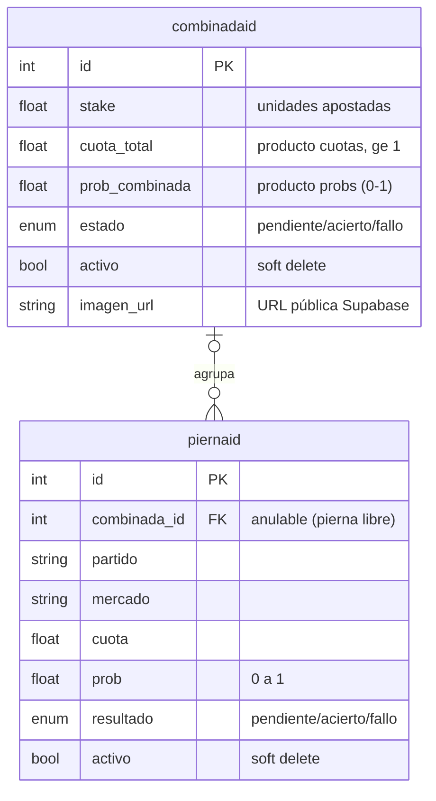
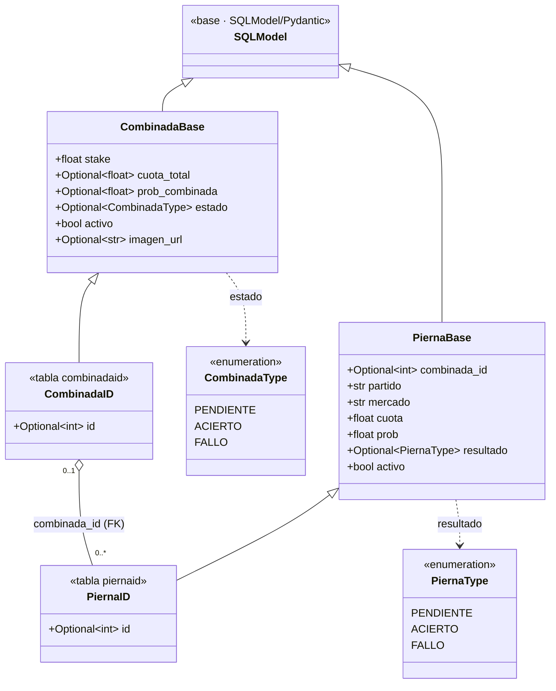
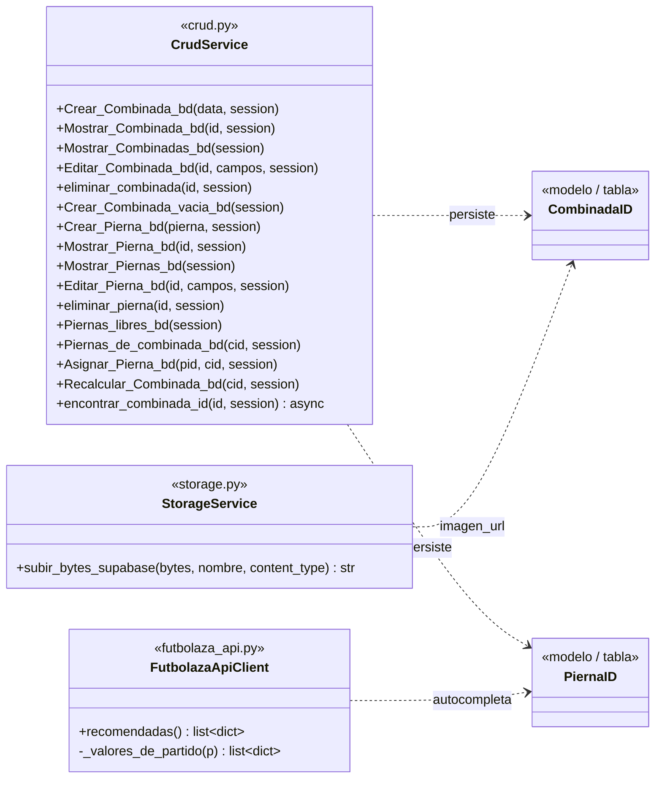
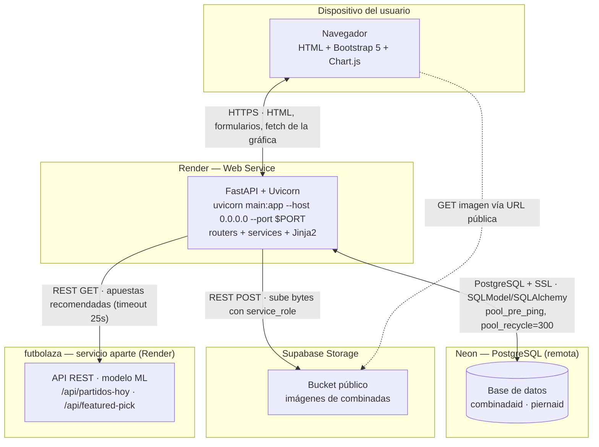
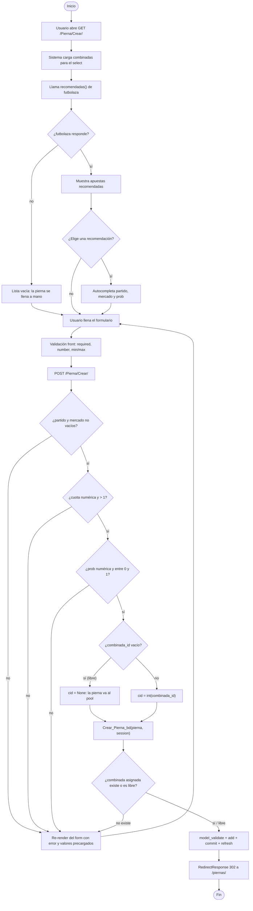
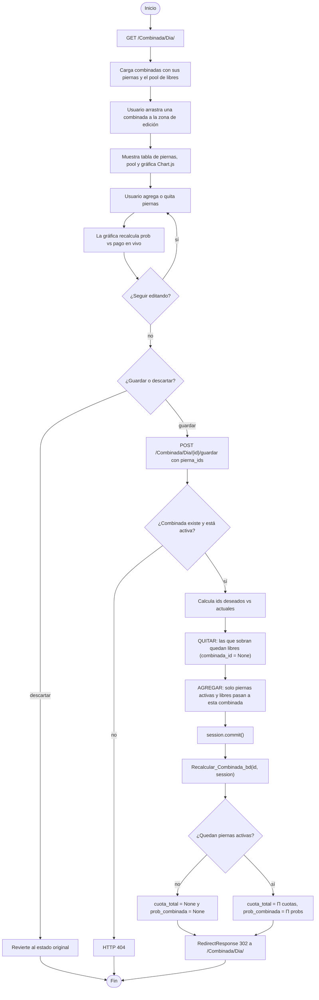

# ⚽ Combinadas — Gestor de apuestas combinadas de fútbol

Aplicación web para **crear y gestionar apuestas combinadas de fútbol**. Permite registrar
apuestas individuales (**piernas**), agruparlas en **combinadas** y calcular automáticamente
la **probabilidad** y la **cuota** resultante. Incluye dashboard con gráficas, subida de
imágenes, búsqueda y consumo de una fuente de datos externa (el modelo de predicción
**futbolaza**).

> **Proyecto Integrador — Ingeniería WEB** · Universidad Católica de Colombia · @sigmotoa
> **Tecnología principal:** FastAPI.

- 🌐 **URL pública:** https://agregacion-furbolazoia.onrender.com
- 📦 **Repositorio:** https://github.com/AndresProgma/agregacion-furbolazoia

---

## 📌 Descripción y reglas de negocio

Una **combinada** agrupa varias **piernas** (apuestas individuales) y **solo se gana si todas
aciertan**. Por eso sus métricas son el **producto** de las de sus piernas:

- **Cuota total** = Π (cuotas de las piernas)
- **Probabilidad combinada** = Π (probabilidades de las piernas)

Al agregar o quitar piernas, los totales de la combinada se **recalculan automáticamente**.
Una pierna sin combinada queda **libre** (`combinada_id = NULL`) y forma un *pool* reutilizable.

## 🧱 Stack tecnológico

| Capa | Tecnología |
|---|---|
| Lenguaje | Python 3 |
| Framework web | **FastAPI** + Uvicorn |
| ORM / modelos | SQLModel + Pydantic |
| Base de datos | PostgreSQL remoto (Neon) |
| Multimedia | Supabase Storage (API REST) |
| Frontend | HTML + Jinja2 + Bootstrap 5 |
| Gráficas | Chart.js |
| Fuente externa | API de **futbolaza** (predicciones ML) |
| Despliegue | Render |

## 🗂️ Estructura del proyecto

```
web_futbol/
├── main.py                     # Puente: reexporta app (uvicorn main:app)
├── app/
│   ├── main.py                 # Crea la app FastAPI y monta los routers
│   ├── core/
│   │   ├── database.py         # Engine y sesión de Neon (PostgreSQL)
│   │   └── templates.py        # Configuración de Jinja2
│   ├── models/                 # CombinadaID, PiernaID y enums
│   ├── routers/                # combinadas, piernas, dashboard
│   ├── services/
│   │   ├── crud.py             # CRUD + lógica de negocio (recalcular)
│   │   ├── storage.py          # Subida de imágenes a Supabase
│   │   └── futbolaza_api.py    # Cliente de la API externa futbolaza
│   └── templates/              # HTML (formularios, listados, dashboard)
├── docs/img/                   # Diagramas del proyecto
└── requirements.txt
```

## 🧩 Modelo de datos (relación 1:N)

Una **Combinada** agrupa muchas **Piernas**; cada Pierna pertenece a lo sumo a una Combinada.
La llave foránea `combinada_id` es **anulable** (para las piernas libres).


![Diagrama ENDPOINTS]



![Diagrama ENDPOINTS]



```mermaid
flowchart LR
  subgraph APP["main.py — FastAPI app"]
    direction TB
    R["GET /  · home (base.html)"]:::get
    DOCS["GET /docs · Swagger automático"]:::get
  end

  subgraph COMB["Router: combinadas.py"]
    direction TB
    subgraph COMB_API["API (JSON)"]
      direction TB
      CA1["POST /Combinada · crear (JSON)"]:::post
      CA2["DELETE /Combinada/{id} · soft delete + cascada"]:::del
      CA3["POST /api/combinada/{cid}/agregar/{pid} · lo llama el JS"]:::post
    end
    subgraph COMB_CRUD["CRUD + multimedia (HTML)"]
      direction TB
      CC1["GET /combinadas/ ?id= · listar / buscar"]:::get
      CC2["GET /Combinada/Crear/ · formulario"]:::get
      CC3["POST /Combinada/Crear/ · valida + crea"]:::post
      CC4["GET /Combinada/{id}/editar · formulario lleno"]:::get
      CC5["POST /Combinada/{id}/editar · valida + actualiza"]:::post
      CC6["POST /Combinada/{id}/eliminar · soft delete (form)"]:::post
      CC7["POST /Combinada/{id}/subir-imagen · Supabase"]:::post
    end
    subgraph COMB_FULL["Armador 'Completa'"]
      direction TB
      CF1["GET /Combinada/Completa/ · pantalla inicio"]:::get
      CF2["POST /Combinada/Completa/ · crea combinada vacía"]:::post
      CF3["GET /Combinada/Completa/{cid} · armador"]:::get
      CF4["POST /Combinada/Completa/{cid}/finalizar · guarda stake"]:::post
    end
  end

  subgraph PIER["Router: piernas.py"]
    direction TB
    P1["GET /piernas/ ?id= · listar / buscar"]:::get
    P2["GET /Pierna/Crear/ · formulario + recomendadas"]:::get
    P3["POST /Pierna/Crear/ · valida + crea"]:::post
    P4["GET /Pierna/{id}/editar · formulario lleno"]:::get
    P5["POST /Pierna/{id}/editar · valida + actualiza"]:::post
    P6["POST /Pierna/{id}/eliminar · soft delete + recalcula"]:::post
  end

  subgraph DASH["Router: dashboard.py"]
    direction TB
    D1["GET /Combinada/Dia/ · editor + gráfica Chart.js"]:::get
    D2["POST /Combinada/Dia/{id}/guardar · agrega/quita + recalcula"]:::post
  end

  classDef get fill:#E6F1FB,stroke:#185FA5,color:#042C53;
  classDef post fill:#E1F5EE,stroke:#0F6E56,color:#04342C;
  classDef del fill:#FCEBEB,stroke:#A32D2D,color:#501313;
```

| Modelo | Campos principales |
|---|---|
| `CombinadaID` | id, stake, cuota_total, prob_combinada, estado, activo, imagen_url |
| `PiernaID` | id, combinada_id (FK, nullable), partido, mercado, cuota, prob, resultado, activo |

## 📐 Diagramas

**Diagrama de clases** (modelos, enums y capa de servicios CRUD):

![Diagrama de clases]



**Diagrama de despliegue** (navegador → FastAPI/Render → Neon, + Supabase + futbolaza):

![Diagrama de despliegue]


**Diagrama de actividades** (flujo principal del dashboard "Combinada del día"):

![Diagrama de actividades]Diagrama 1 — Crear una pierna (con recomendadas de futbolaza, doble validación y decisión libre/asignada):

Combinada del día (armador en vivo, guardar/descartar y recálculo como producto):


## ⚙️ Funcionalidades

- [x] **CRUD completo** de Combinada y Pierna (crear / leer / editar / eliminar con *soft delete*)
- [x] **Lógica de negocio**: `Recalcular_Combinada_bd` calcula cuota y prob como producto de las piernas
- [x] **Multimedia**: subir imagen a la combinada (Supabase Storage)
- [x] **Formularios HTML** con validación en front y back
- [x] **Búsqueda** por id en `/combinadas/?id=` y `/piernas/?id=`
- [x] **Dashboard "Combinada del día"**: gráfica probabilidad vs pago (Chart.js) y editor en vivo
- [x] **Fuente externa**: autocompletar piernas con las apuestas recomendadas de futbolaza
- [x] **API REST + Swagger** automático en `/docs`

## 🔗 Integración con futbolaza (fuente de datos externa)

[futbolaza](https://futbolazoia.live) es un predictor de fútbol basado en *machine learning*
entrenado sobre un histórico de partidos. Esta app **consume su API REST**
(`/api/partidos-hoy`, `/api/featured-pick`) para obtener las **apuestas recomendadas**. Al
crear una pierna, el usuario elige una recomendación y se autocompletan **partido, mercado y
probabilidad**. Así, los datos históricos del modelo alimentan la gestión de las piernas.

Implementación: `app/services/futbolaza_api.py` + `app/routers/piernas.py` + `app/templates/crear_pierna.html`.

## 🔌 Endpoints principales

| Método | Ruta | Descripción |
|---|---|---|
| `GET` | `/` | Página de inicio (HTML) |
| `GET/POST` | `/Combinada/Crear/` | Crear combinada (formulario) |
| `GET/POST` | `/Pierna/Crear/` | Crear pierna (formulario + recomendadas) |
| `GET` | `/combinadas/?id=` | Listar / buscar combinadas |
| `GET` | `/piernas/?id=` | Listar / buscar piernas |
| `GET/POST` | `/Combinada/Dia/` | Dashboard: gráfica y editor en vivo |
| `POST` | `/Combinada/{id}/subir-imagen` | Subir imagen a Supabase |
| `POST` | `/Combinada` | Crear combinada vía API (JSON) |
| `DELETE` | `/Combinada/{id}` | Eliminar combinada vía API (JSON) |
| `GET` | `/docs` | Documentación Swagger automática |

## ✅ Validación de datos (front y back)

| Capa | Qué valida |
|---|---|
| Frontend (HTML) | `required`, `type=number`, `min`/`max`, `step`, `maxlength`, `<select>` de enums |
| Backend (FastAPI) | `try/except` + rangos; re-render del formulario con alerta y valores precargados |
| Modelo (Pydantic) | `Field(ge=, le=)` en cuota y prob (última red) |

Códigos de error: **422** (datos mal formados, automático de Pydantic), **404** (recurso
inexistente, manual) y **400** (lógica/BD no puede procesar).

## ▶️ Instalación y ejecución local

```bash
pip install -r requirements.txt
uvicorn main:app --reload
```

Variables de entorno (`.env`):

```
url_basededatos=postgresql://...neon...      # cadena de conexión de Neon
SUPABASE_URL=https://xxxx.supabase.co
SUPABASE_KEY=...service_role...
SUPABASE_BUCKET=imagenes ia
FUTBOLAZA_URL=https://futbolazoia.live       # opcional (valor por defecto)
```

## ☁️ Despliegue

- **App:** Render (Web Service, `uvicorn main:app --host 0.0.0.0 --port $PORT`)
- **Base de datos:** Neon PostgreSQL (remota)
- **Multimedia:** Supabase Storage (bucket público)

## 📄 Documentación

El **documento técnico** completo (con diagramas y evidencias) está en
`DOCUMENTO_TECNICO.docx`. Las preguntas de sustentación preparadas, en
`preguntas_sustentacion.txt`.

## 👤 Autor

- **Nombre:** [ Andres Felipe Martinez Castañeda ]
- **Código:** [ 67001021]
- Universidad Católica de Colombia — Ingeniería WEB — @sigmotoa
