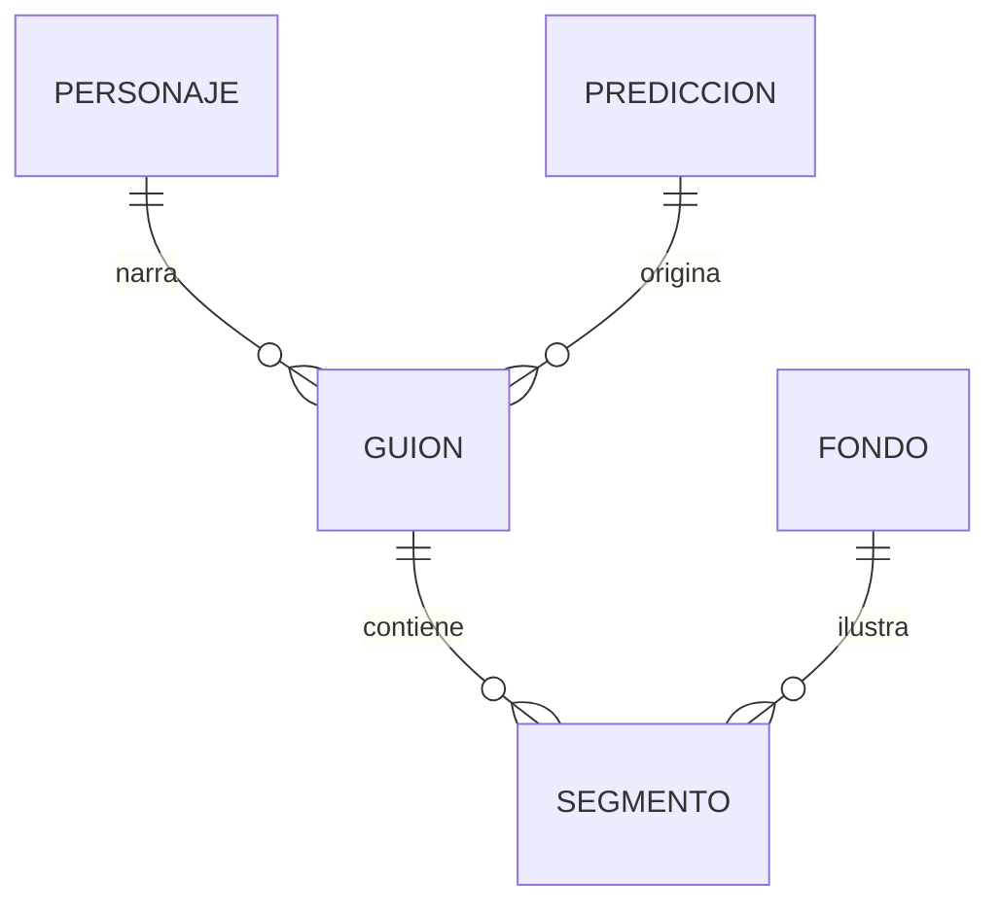

# SmartBet AI — Studio de Guiones para TikTok ⚡

> Generador de **guiones y assets** para videos cortos (TikTok / Reels / Shorts) a partir de **predicciones de fútbol con IA**. Convierte la salida de un modelo de predicción en un guion cronometrado, narrado por una mascota, con estética tipo *Bloomberg + FIFA + Trading*.

> **Estado:** en desarrollo (iteración del Proyecto Integrador). Las secciones marcadas con 🔜 están planificadas y aún no implementadas.

---

## 📌 Descripción

Esta aplicación toma una **predicción** (equipos, probabilidades, xG, valor detectado, etc.) y genera automáticamente el **guion exacto de un video vertical**: una lista de segmentos cronometrados donde cada uno define *qué dice la mascota*, *qué texto aparece en pantalla*, *qué efecto visual* y *qué imagen de fondo* se usa. El usuario solo rellena formularios HTML; la lógica de negocio arma el guion.

El objetivo de marca es que el contenido se vea como **ingeniería de datos, no como casino**: minimalista, frío, preciso, con dashboards y semáforos de decisión reconocibles.

## 🎯 Objetivo

Automatizar la producción de contenido para redes a partir de predicciones de fútbol, manteniendo una **identidad visual consistente** y reduciendo el tiempo de guionizado a segundos.

## 🔗 Relación con Futbolazoia.live

[Futbolazoia.live](https://github.com/AndresProgma/Futbolazoia.live) es un predictor de Champions League (ELO + ensemble de ML, FastAPI + SQLModel). Funciona como **fuente de datos** de este proyecto: cada predicción que produce puede alimentar el modelo `Prediccion` de este Studio para generar el video correspondiente.

## 🧱 Stack tecnológico

- **Backend:** Python 3.12, FastAPI, SQLModel, Pydantic
- **Base de datos:** PostgreSQL remoto (Neon)
- **Storage multimedia:** Supabase (fondos e imagen de la mascota)
- **Frontend:** HTML + Jinja2, Tailwind CSS (CDN), Chart.js (CDN) para dashboards
- **Despliegue:** 🔜 Render

## 🗂️ Estructura del proyecto

```
web_futbol/
├── main.py            # App FastAPI + rutas (capa controlador)
├── db.py              # Engine, sesión y dependencia de BD remota
├── Modelos.py         # Modelos SQLModel (Personaje, Prediccion, Guion, Segmento, Fondo)
├── modelo_type.py     # Enums de dominio (Tono, Semaforo, Efecto, ...)
├── operation_db.py    # CRUD contra la base de datos
├── utils.py           # build_guion() + carga de multimedia a Supabase
├── templates/         # HTML (formularios, dashboards, vista de guion)
└── requirements.txt
```

## 🧩 Modelos y relaciones



| Modelo | Rol | Multimedia |
|---|---|---|
| `Personaje` | La mascota (imagen) que aparece en el video | imagen |
| `Prediccion` | Datos del modelo de fútbol (xG, probabilidades, semáforo de valor) | — |
| `Guion` | El video: une predicción + personaje + marca, define hook y plataforma | — |
| `Segmento` | Cada parte cronometrada del loop (hook→dashboard→predicción→CTA) | — |
| `Fondo` | Imágenes de fondo reutilizables | imagen |

**Relación N:M:** `Guion` ↔ `Fondo` a través de `Segmento` (un fondo se reutiliza en muchos videos; un video usa muchos fondos).

## ⚙️ Funcionalidades

- [x] Modelado de datos con relaciones 1:N y N:M
- [ ] 🔜 CRUD completo de `Guion`, `Prediccion` y `Personaje`
- [ ] 🔜 Generador de guion (`build_guion()`): arma los segmentos a partir de la predicción y la plantilla de marca
- [ ] 🔜 Carga y visualización de multimedia (fondos / mascota) en Supabase
- [ ] 🔜 Búsqueda en HTML (por equipo, liga o estado del guion)
- [ ] 🔜 Dashboards: predicciones por equipo, valor detectado, guiones generados
- [ ] 🔜 Validación de datos en front y back
- [ ] 🔜 Despliegue en URL pública

## 🎨 Identidad visual (branding)

Coherencia obligatoria en todos los videos:

- **Fondo oscuro** (negro / azul profundo)
- **Verde neón / azul eléctrico** para datos y valores
- **Tipografía monoespaciada** (sensación de código/terminal)
- **Números grandes** y animados (barras, contadores)
- **Semáforo de decisión:** 🟢 ALTO · 🟡 MEDIO · 🔴 EVITAR
- **Loop de contenido:** ALERTA → DASHBOARD → MODELO → PREDICCIÓN → SEMÁFORO → CTA
- Tono **frío y minimalista**: "esto es ingeniería, no casino"

## 🧠 Generador de guion (lógica de negocio)

`build_guion(prediccion, personaje)` produce una lista ordenada de `Segmento`. El estilo visual (colores, tipografía, tono frío) es fijo y vive en el CSS / la lógica de `build_guion`, no en BD. Ejemplo de salida:

```
SEG 1 · HOOK (0–1s)        "⚠ MODELO DETECTA VALOR"      [glitch + alerta]
SEG 2 · DASHBOARD (1–9s)   xG 2.31 vs 1.12 · Tiros 16/9   [fondo: estadio]
SEG 3 · PREDICCIÓN (9–18s) "OVER 2.5 → 78%"               [barra que se llena]
SEG 4 · SEMÁFORO (18–24s)  🟢 HIGH VALUE                   [fondo: gráfico]
SEG 5 · CTA (24–30s)       "Los números no mienten. Sígueme." [fondo: mascota]
```

## 🔌 Endpoints (previstos) 🔜

| Método | Ruta | Descripción |
|---|---|---|
| `POST` | `/predicciones` | Registrar una predicción (manual o desde Futbolazoia) |
| `POST` | `/guiones` | Crear un guion (genera los segmentos) |
| `GET`  | `/guiones/{id}` | Ver el guion completo en HTML |
| `GET`  | `/guiones?buscar=` | Buscar guiones por equipo/liga/estado |
| `POST` | `/fondos` | Subir imagen de fondo a Supabase |
| `GET`  | `/dashboard` | Reportes y gráficas |
| `GET`  | `/docs` | Swagger automático |

## ▶️ Instalación y ejecución 🔜

```bash
pip install -r requirements.txt
uvicorn main:app --reload
```

Variables de entorno (`.env`): `DATABASE_URL`, `SUPABASE_URL`, `SUPABASE_KEY`, `SUPABASE_BUCKET`.

## ☁️ Despliegue

- **URL pública:** 🔜 _pendiente_
- **Repositorio:** 🔜 _pendiente_

## 🗺️ Roadmap

1. Definir `modelo_type.py` (enums) y `model.py` (modelos + relaciones)
2. Conexión a BD remota (`db.py`)
3. CRUD y `build_guion()`
4. Multimedia con Supabase
5. Templates HTML + dashboards + búsqueda
6. Despliegue y documentación final (diagramas de clase, actividades, despliegue)

## 👤 Autor

- **Nombre:** _pendiente_
- **Código:** _pendiente_
- Universidad Católica de Colombia — Ingeniería WEB — @sigmotoa
